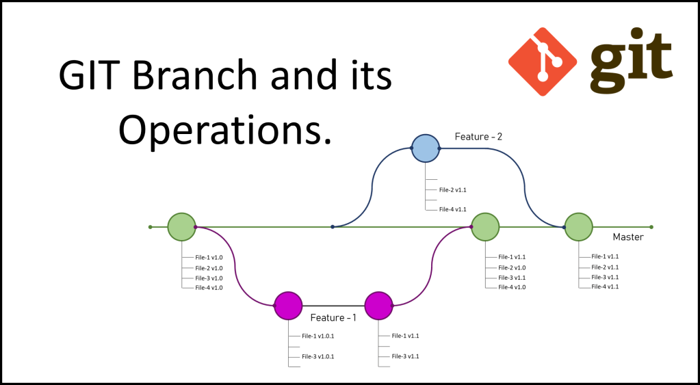

# Заголовок

## 2 уровень

основная часть кода

<!-- тут комментарий -->
// комментарий

1234

12345

0987

09876

11111

---


# Markdown

**Markdown** (МФА: [ˈmɑːkdaʊn], произносится маркда́ун) — облегчённый язык разметки, созданный с целью обозначения форматирования в простом тексте, с максимальным сохранением его читаемости человеком, и пригодный для машинного преобразования в языки для продвинутых публикаций (*HTML*, *Rich Text* и других).

[Руководство по оформлению Markdown-файлов](https://gist.github.com/Jekins/2bf2d0638163f1294637)
## Синтаксис языка

### Выделение текста
*Markdown* воспринимает звёздочки «*» и символы подчёркивания «_» как признаки смыслового выделения текста:


##### Курсив
Текст, окружённый одиночными «\*» или «\_», будет заключен в HTML-тэг `<em>`.
`*Пример*`, или `_Пример_` даст на выходе: *Пример*


##### Полужирный
Текст, окружённый двойными «\*» или «\_», будет заключен в HTML-тэг `<strong>`.
`**Пример**` или `__Пример__` даст на выходе: **Пример**

##### Полужирный курсив
Текст, выделенный курсивным полужирным шрифтом с использованием синтаксиса языка *Markdown* выглядит следующим образом:
`***Пример***` или `___Пример___`, что даёт: ***Пример***

##### Зачёркнутый
Текст, окружённый двойными символами «~», будет выделен как зачёркнутый.
`~~Пример~~` даст на выходе: ~~Пример~~

##### Верхний индекс
Текст, окружённый двойными символами «^», будет выделен как верхний индекс.
`^Пример^` даст на выходе: ^Пример^

##### Нижний индекс
Текст, окружённый двойными символами «^», будет выделен как нижний индекс.
`~Пример~` даст на выходе: ~Пример~

##### HTML-тег
Любой текст в угловых скобках `<...>` воспринимается как HTML-тег и не отображается на странице в явном виде.

### Основные элементы

#### Заголовки

Язык разметки *Markdown* поддерживает 2 стиля обозначения заголовков: подчеркивание и выделение символом («#»). Выделение заголовков с помощью подчеркивания производится знаками равенства («=») в случае, если заголовок первого уровня, и дефисами («-») в случае, если заголовок второго уровня. Количество знаков подчеркивания не ограничивается. При выделении заголовков с помощью символа («#») используется от одного до шести данных символов, которые устанавливаются в начале строки (перед заголовком). В данном случае количество символов соответствует уровню заголовка. Кроме того, заголовок возможно снабдить закрывающимися символами («#»), хотя это и не является обязательным. Количество закрывающихся символов не обязано соответствовать количеству начальных символов. Уровень заголовка определяется по количеству начальных символов.
Заголовки первого и второго уровней, выполненные с помощью подчеркивания, выглядят следующим образом:

```
Заголовок первого уровня
========================
Заголовок второго уровня
-------------------------
```
Заголовки первого, третьего и шестого уровней, выполненные с помощью символа («#»), выглядят следующим образом:

```
#  Заголовок первого уровня
### Заголовок третьего уровня
###### Заголовок шестого уровня
```
Приведенные выше заголовки, выполненные с помощью символа («#») тождественны следующим:
```
#  Заголовок первого уровня #
### Заголовок третьего уровня ###
###### Заголовок шестого уровня ######
```
В результате на экран выводится следующее:

Заголовок первого уровня
========================
Заголовок второго уровня
------------------------

# Заголовок первого уровня
### Заголовок третьего уровня
###### Заголовок шестого уровня

---
#### Цитаты

Для обозначения цитат в языке Markdown используется знак «больше» («>»). Его можно вставлять как перед каждой строкой цитаты, так и только перед первой строкой параграфа. Также синтаксис Markdown позволяет создавать вложенные цитаты (цитаты внутри цитат). Для их разметки используются дополнительные уровни знаков цитирования («>»). Цитаты в Markdown могут содержать всевозможные элементы разметки. Цитаты в языке Markdown выглядят следующим образом:

```
>Это пример цитаты,
>в которой перед каждой строкой
>ставится угловая скобка.
```

```
>Это пример цитаты,
в которой угловая скобка
ставится только перед началом нового параграфа.
>Второй параграф.
```

Вложение цитаты в цитату выглядит следующим образом:
```
> Первый уровень цитирования
>> Второй уровень цитирования
>>> Третий уровень цитирования
>
>Первый уровень цитирования
```

В результате на экран выводится следующее:

> Это пример цитаты,
> в которой перед каждой строкой
> ставится угловая скобка.

> Это пример цитаты, в которой угловая скобка ставится только перед началом нового параграфа.
> Второй параграф.

Вложенная цитата:

> Первый уровень цитирования
>> Второй уровень цитирования
>>> Третий уровень цитирования
>
> Первый уровень цитирования

Уровень цитирования не может превышать 15-й.

#### Списки
*Markdown* поддерживает упорядоченные (нумерованные) и неупорядоченные (ненумерованные) списки. Для формирования неупорядоченный списков используются такие маркеры, как звездочки, плюсы и дефисы. Все перечисленные маркеры могут использоваться взаимозаменяемо. Для формирования упорядоченных списков в качестве маркеров используются числа с точкой. Важной особенностью в данном случае является то, что сами номера, с помощью которых формируется список, не важны, так как они не оказывают влияния на выходной HTML код. Как бы ни нумеровал пользователь список, на выходе он в любом случае будет иметь упорядоченный список, начинающийся с единицы (1, 2, 3…). Эту особенность стоит учитывать в том случае, когда необходимо использовать порядковые номера элементов в списке, чтобы они соответствовали номерам, получающимся в HTML. Упорядоченные списки всегда следует начинать с единицы. Маркеры списков обычно начинаются с начала строки, однако они могут быть сдвинуты, но не более чем на 3 пробела. За маркером должен следовать пробел, либо символ табуляции. При необходимости в список можно вставить цитату. В этом случае обозначения цитирования ( «>» ) нужно писать с отступом.

**Упорядоченные списки** выглядят следующим образом:

```
1.	Проводник
2.	Полупроводник
3.	Диэлектрик
```

**Неупорядоченные списки** выглядят следующим образом:

```
* Проводник
* Полупроводник
* Диэлектрик
```

Или

```
- Проводник
- Полупроводник
- Диэлектрик
```

Или

```
+ Проводник
+ Полупроводник
+ Диэлектрик
```

На выходе всех трех перечисленных вариантов имеется один и тот же результат. В результате на экран выводится следующее:

1.  Проводник
2.  Полупроводник
3.  Диэлектрик

и

* Проводник
* Полупроводник
* Диэлектрик


#### Блок кода

Для вывода блока кода в *Markdown* текст ограничивают сверху и снизу строками, содержащими ` ``` `.

Пример блока кода:

```
numbers = [77, 46, 11, 89, 48, 14, 67, 73, 22, 26]
sorted_size = 0
size = len(numbers)

while (sorted_size < size - 1):
    index = 0

    while (index < (size - 1 - sorted_size)):
        if (numbers[index] > numbers[index + 1]):
            temp = numbers[index]
            numbers[index] = numbers[index + 1]
            numbers[index + 1] = temp
        index += 1

    sorted_size += 1

print(numbers)
```

Если фрагмент кода располагается внутри абзаца, его просто оборачивают в ``` ` ```. В результате получается: ` print(a + b) `.

### Изображения

В *Markdown* существует 2 способа вставки изображений в документ:

##### a. С помощью непосредственного указания URL-адреса изображения.
Синтаксис данной команды выглядит следующим образом:

```

```

или

```

```

Иными словами, он состоит из следующих элементов:
* восклицательный знак;
* квадратные скобки, в которых указывается альтернативный изображению текст (он станет содержимым атрибута в элементе img);
* круглые скобки, содержащие URL-адрес или относительный путь изображения, а также (необязательно) всплывающую подсказку, заключённуе в двойные или одиночные кавычки.

  ##### *Задание размера изображения*

  ```
  [](/путь/к/изображению.jpg)
  ```

##### **b.** С помощью метки-идентификатора.
Синтаксис данной команды записывается следующим образом:

```
![Альтернативный текст][id]
```

где «id» — имя определённой метки изображения. Метки изображений определяются при помощи синтаксиса, совершенно идентичного меткам гиперссылок:

[id]: путь/к/изображению "Необязательная подсказка"
Важной особенностью является то, что Markdown не позволяет задать размеры изображения (ширину, высоту).

---


# Git

**Git** (произносится «гит») — распределённая система управления версиями. Проект был создан *Линусом Торвальдсом* для управления разработкой ядра Linux, первая версия выпущена 7 апреля 2005 года. На сегодняшний день его поддерживает Джунио Хамано.

[Памятка по Git](https://docs.github.com/ru/get-started/quickstart/git-cheatsheet)

### Основные команды

* **`git --version`** — выводит текущую версию git.
* **`git init`** — инициализирует проект git в текущей папке, В папке создаётся скрытая папка **.git**.
* **`git status`** — показывает текущее состояние гита, есть ли изменения, которые нужно закоммитить (сохранить).
* **`git add`**` [file_name]` — добавляет заданный файл в индекс (staging area) для последующего коммита. Эта команда дается после добавления файлов.
* **`git add .`** — добавляет содержимое рабочего каталога в индекс (staging area) для последующего коммита. Эта команда дается после добавления файлов.
* **`git commit -m`**` [commit_message]` — берёт все данные, добавленные в индекс с помощью git add, и сохраняет их слепок во внутренней базе данных, а затем сдвигает указатель текущей ветки на этот слепок.
* **`git commit -am`**` [commit_message]` — создание коммита с автоматическим добавлением всех файлов в индекс. (Идентично: **`git add . && git commit -m`**` [commit_message]`)
* **`git log`** — выводит Журнал изменений.
* **`git checkout`** — переключение между версиями. Для работы нужно указать не только интересующий вас коммит, но и вернуться в тот, где работаем, при помощи команды `git checkout master`.
* **`git diff`** — показывает разницу между текущим файлом и сохранённым.

### Ветвление
[](./img/GIT-Branchand-its-Operations.webp)
* **`git branch`** — выводит список веток.
* **`git branch`**` [branch_name]` — создает ветку с указанным именем.
* **`git checkout`**` [branch_name]` — переключение на ветку с указанным именем.
* **`git checkout -b`**` [branch_name]` — создание на ветки с указанным именем и переход на неё (идентично: **`git branch`**` [branch_name] `**` && git checkout`**` [branch_name]`).

#### Слияние веток
* **`git merge`**` [branch_name]` — обединяет указанную ветку с текущей.
* **`git merge --no-ff`**` [branch_name]` — обединяет указанную ветку с текущей, флаг **--no-ff** вынуждает Git всегда создавать новый объект коммита при слиянии, даже если слияние может быть осуществлено алгоритмом fast-forward. Это позволяет не терять информацию о том, что ветка существовала, и группирует вместе все внесённые изменения.
[](./img/FMD5h.png)
Подробнее: [Удачная модель ветвления для Git](https://habr.com/ru/post/106912/)


#### Удаление веток
* **`git branch -d`**` [branch_name]` — удаляет ветку с указанным именем, сокращенный вариант записи **`--delete`**.
Если в ветке присутствуют несмерженные изменения или незапушенные коммиты, флаг **`-d`** не позволит удалить такую локальную ветку.
Это связано с тем, что эти коммиты нигде более не отслеживаются, и Git защищает пользователя от случайной потери этих данных.
* **`git branch -D`**` [branch_name]` — принудительно удаляет ветку с указанным именем, сокращенный вариант записи **`--delete --force`**.
* **`git push `**`[remote_name]`**` -d`**` [branch_name]` — удаляет удалённую ветку с указанным именем.
